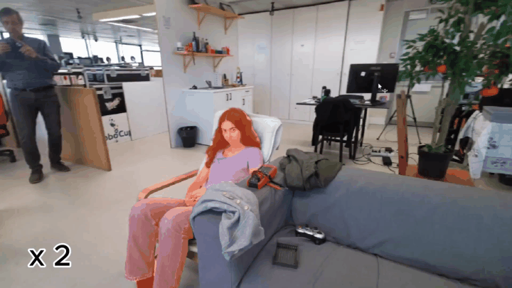

# ReID-SAMURAI

**Identity-aware multi-person tracking for social robotics.**

ReID-SAMURAI extends **SAMURAI / SAM 2** with **TransReID** to preserve identities through occlusion, disappearance, re-entry, and close multi-person interactions. This repository contains the code for the final system used in the thesis **“Robust Multi-Person Re-Identification and Tracking for Social Robotics”**.

For the full explanation, results, and additional videos, please visit the **[project page](https://inessousa11.github.io/person-reid-website/)**.

<p align="center">
  <a href="https://inessousa11.github.io/person-reid-website/">
    
  </a>
</p>

<p align="center">
  <em>Click the teaser to open the full project page.</em>
</p>

---

## What this repository includes

- the **ReID-SAMURAI** online tracking implementation;
- **video** and **webcam** interactive demos;
- **TransReID** and alternative ReID backends;
- debugging tools for masks, memory, galleries, candidates, and scores.

Main entry points:

```text
demo/video_deep_debug_reid.py
demo/webcam_deep_debug_reid.py
```

---

## Architecture

### Normal identity-aware tracking


### ReID-guided reacquisition


More explanation of the architecture is available on the **[project page](https://inessousa11.github.io/person-reid-website/)**.

---

## Setup

### 1. Clone with submodules

```bash
git clone --recurse-submodules https://github.com/InesSousa11/samurai-real-time.git
cd samurai-real-time
```

If needed later:

```bash
git submodule update --init --recursive
```

### 2. Create a virtual environment

#### Windows PowerShell
```powershell
python -m venv .venv
.\.venv\Scripts\Activate.ps1
```

#### Linux / macOS
```bash
python3 -m venv .venv
source .venv/bin/activate
```

### 3. Install PyTorch and torchvision

Install a CUDA-compatible build for your machine using the official PyTorch instructions:

[https://pytorch.org/get-started/locally/](https://pytorch.org/get-started/locally/)

### 4. Install the remaining dependencies

```bash
pip install -r requirements.txt
```

---

## Checkpoints

Place the following files at these locations:

```text
checkpoints/sam2.1_hiera_small.pt
checkpoints/reid/transreid/vit_transreid_msmt.pth
```

The TransReID checkpoint is the **TransReID*(ViT) MSMT17** model from the official repository:

[https://github.com/damo-cv/TransReID](https://github.com/damo-cv/TransReID)

The interactive demos also use `yolov8s.pt`, which Ultralytics can download automatically if needed.

---

## Important TransReID note

After cloning the repo, apply this required compatibility fix inside the TransReID submodule:

Open:

```text
external/reid/TransReID/model/backbones/vit_pytorch.py
```

Replace:

```python
from torch._six import container_abcs
```

with:

```python
import collections.abc as container_abcs
```

---

## Run the video demo

```powershell
python demo/video_deep_debug_reid.py `
  --video_path "C:\path\to\video.mp4"
```

Optional useful argument:

```text
--reid_thr 0.80
```

---

## Run the webcam demo

```powershell
python demo/webcam_deep_debug_reid.py `
  --camera 0 `
  --reid_backend transreid
```

To hide the debugging HUD:

```powershell
python demo/webcam_deep_debug_reid.py `
  --camera 0 `
  --reid_backend transreid `
  --hide_hud
```

---

## Controls

### Video demo
- **Left / Right arrows**: select YOLO person candidate
- **A**: add selected candidate
- **T**: start / resume tracking
- **Space**: pause / resume
- **P**: prompting mode
- **D**: export debug case
- **Y**: toggle YOLO proposals
- **+ / -**: adjust YOLO confidence
- **R**: reset
- **Q / Esc**: quit

### Webcam demo
- **Left / Right arrows**: select YOLO person candidate
- **A**: add selected candidate
- **T**: start tracking
- **D**: export debug case
- **Y**: toggle YOLO proposals
- **+ / -**: adjust YOLO confidence
- **R**: reset
- **Q / Esc**: quit

---

## ReID backends

Supported backend names:

```text
transreid
transreid_msmt
osnet
osnet_x1_0
osnet_ain
osnet_ain_x1_0
```

The final thesis system uses **`transreid`**.

---

## Citation

```bibtex
@mastersthesis{sousa2026robust,
  author  = {In{\^e}s Gomes Crispim de Sousa},
  title   = {Robust Multi-Person Re-Identification and Tracking for Social Robotics},
  school  = {Instituto Superior T{\'e}cnico, Universidade de Lisboa},
  year    = {2026}
}
```

---

## Acknowledgements

This work builds on:

- [SAM 2](https://github.com/facebookresearch/sam2)
- [SAMURAI](https://github.com/yangchris11/samurai)
- [TransReID](https://github.com/damo-cv/TransReID)
- [deep-person-reid](https://github.com/KaiyangZhou/deep-person-reid)
- [Ultralytics YOLO](https://github.com/ultralytics/ultralytics)

---

## Links

- **Project page:** [https://inessousa11.github.io/person-reid-website/](https://inessousa11.github.io/person-reid-website/)
- **Repository:** [https://github.com/InesSousa11/samurai-real-time](https://github.com/InesSousa11/samurai-real-time)
