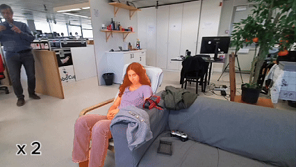

# ReID-SAMURAI

<p align="center">
  <strong>Identity-aware multi-person tracking for social robotics</strong>
</p>

<p align="center">
  ReID-SAMURAI extends <strong>SAMURAI / SAM 2</strong> with <strong>TransReID</strong> to preserve identities through occlusion, disappearance, re-entry, and close multi-person interactions.
</p>

<p align="center">
  <a href="https://inessousa11.github.io/person-reid-website/">Project Page</a> |
  <a href="https://github.com/InesSousa11/samurai-real-time">Repository</a>
</p>

<p align="center">
  
</p>

## Abstract

This repository contains the code for **ReID-SAMURAI**, the final system developed for the MSc thesis **“Robust Multi-Person Re-Identification and Tracking for Social Robotics”**.

The method augments SAMURAI with a person ReID branch based on **TransReID**, online identity galleries, identity-aware memory selection, and **ReID-guided reacquisition**. The goal is to support robust online multi-person tracking from a moving robot camera, while keeping identities consistent through occlusions, temporary disappearance, and re-entry.

For the full explanation, benchmark results, and additional videos, please check the **[project page](https://inessousa11.github.io/person-reid-website/)**.

## Highlights

- identity-aware extension of **SAMURAI / SAM 2**;
- **TransReID** as the main ReID backend;
- one online appearance gallery per tracked identity;
- identity-aware memory filtering;
- ReID-guided reacquisition of lost identities;
- interactive **video** and **webcam** demos;
- detailed debugging tools for masks, memory, galleries, candidates, and scores.

## Architecture

### Normal identity-aware tracking


### ReID-guided reacquisition


## Installation

### 1. Clone the repository with submodules

```bash
git clone --recurse-submodules https://github.com/InesSousa11/samurai-real-time.git
cd samurai-real-time
```

If you already cloned without submodules:

```bash
git submodule update --init --recursive
```

### 2. Create a virtual environment

#### Windows PowerShell

```powershell
python -m venv .venv
.\.venv\Scripts\Activate.ps1
```

#### Linux / macOS

```bash
python3 -m venv .venv
source .venv/bin/activate
```

### 3. Install PyTorch and torchvision

Install a CUDA-compatible build for your system following the official PyTorch instructions:

[https://pytorch.org/get-started/locally/](https://pytorch.org/get-started/locally/)

### 4. Install the remaining dependencies

```bash
pip install -r requirements.txt
```

## Checkpoints

Place the following files at these locations:

```text
checkpoints/sam2.1_hiera_small.pt
checkpoints/reid/transreid/vit_transreid_msmt.pth
```

The TransReID checkpoint is the **TransReID*(ViT) MSMT17** model from the official repository:

[https://github.com/damo-cv/TransReID](https://github.com/damo-cv/TransReID)

The demos also use `yolov8s.pt`, which Ultralytics can download automatically if needed.

## Important TransReID compatibility fix

After cloning the repository, apply this required compatibility change inside the TransReID submodule.

Open:

```text
external/reid/TransReID/model/backbones/vit_pytorch.py
```

Replace:

```python
from torch._six import container_abcs
```

with:

```python
import collections.abc as container_abcs
```

## Quick start

### Video demo

```powershell
python demo/video_deep_debug_reid.py `
  --video_path "C:\path\to\video.mp4"
```

Useful optional argument:

```text
--reid_thr 0.80
```

### Webcam demo

```powershell
python demo/webcam_deep_debug_reid.py `
  --camera 0 `
  --reid_backend transreid
```

To hide the debugging HUD:

```powershell
python demo/webcam_deep_debug_reid.py `
  --camera 0 `
  --reid_backend transreid `
  --hide_hud
```

## Controls

### Video demo

- **Left / Right arrows**: select YOLO person candidate
- **A**: add selected candidate
- **T**: start / resume tracking
- **Space**: pause / resume
- **P**: prompting mode
- **D**: export debug case
- **Y**: toggle YOLO proposals
- **+ / -**: adjust YOLO confidence
- **R**: reset
- **Q / Esc**: quit

### Webcam demo

- **Left / Right arrows**: select YOLO person candidate
- **A**: add selected candidate
- **T**: start tracking
- **D**: export debug case
- **Y**: toggle YOLO proposals
- **+ / -**: adjust YOLO confidence
- **R**: reset
- **Q / Esc**: quit

## ReID backends

Supported backend names:

```text
transreid
transreid_msmt
osnet
osnet_x1_0
osnet_ain
osnet_ain_x1_0
```

The final thesis system uses **`transreid`**.

## Citation

```bibtex
@mastersthesis{sousa2026robust,
  author  = {In{\^e}s Gomes Crispim de Sousa},
  title   = {Robust Multi-Person Re-Identification and Tracking for Social Robotics},
  school  = {Instituto Superior T{\'e}cnico, Universidade de Lisboa},
  year    = {2026}
}
```

## Acknowledgements

This work builds on:

- [SAM 2](https://github.com/facebookresearch/sam2)
- [SAMURAI](https://github.com/yangchris11/samurai)
- [TransReID](https://github.com/damo-cv/TransReID)
- [deep-person-reid](https://github.com/KaiyangZhou/deep-person-reid)
- [Ultralytics YOLO](https://github.com/ultralytics/ultralytics)
