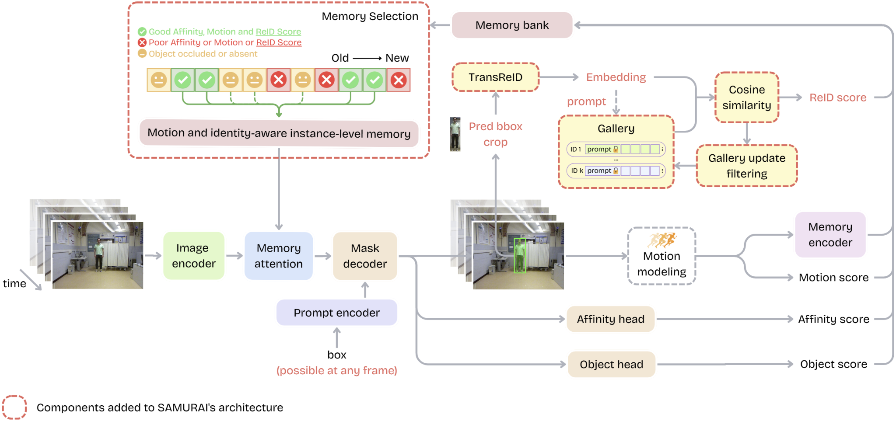
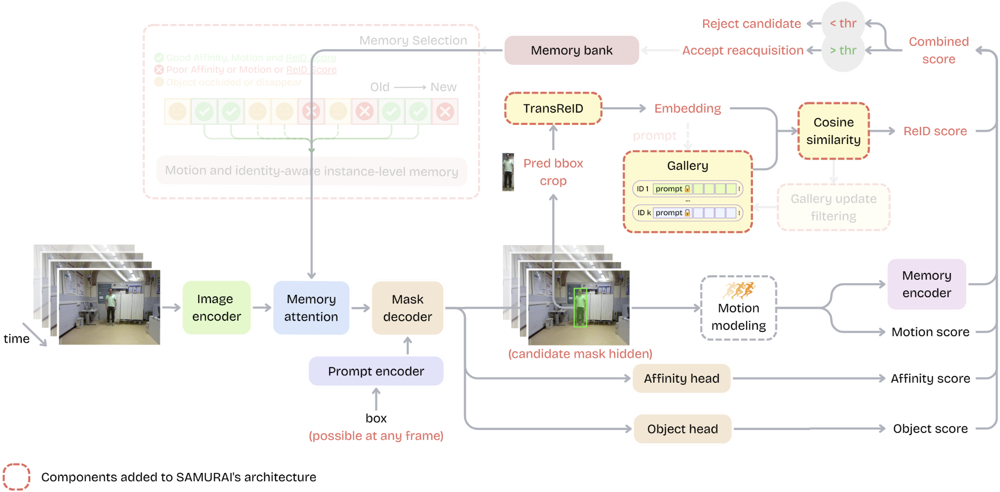

# ReID-SAMURAI: Robust Multi-Person Re-Identification and Tracking for Social Robotics

<p align="center">
  <strong>Inês Gomes Crispim de Sousa</strong>
</p>

<p align="center">
  Instituto Superior Técnico · Institute for Systems and Robotics
</p>

<p align="center">
  <a href="https://inessousa11.github.io/person-reid-website/">[Project Page]</a>
  &nbsp;
  <a href="#qualitative-comparison">[Comparison]</a>
  &nbsp;
  <a href="#getting-started">[Getting Started]</a>
  &nbsp;
  <a href="#demo-on-custom-video">[Demo]</a>
  &nbsp;
  <a href="#citation">[Citation]</a>
</p>

This repository contains the implementation of **ReID-SAMURAI**, an identity-aware extension of SAMURAI for online multi-person tracking. It combines SAMURAI / SAM 2 mask propagation with **TransReID**, online identity galleries, identity-aware memory selection, and ReID-guided reacquisition.

For the complete method, results, and additional videos, visit the **[project page](https://inessousa11.github.io/person-reid-website/)**.

## Qualitative Comparison

The synchronized comparison below shows the behavior of the two baseline subsystems alongside the proposed system on the KTP Translation sequence.

<p align="center">
  <a href="assets/readme/comparison_demo.mp4">
    
  </a>
</p>

<p align="center">
  <em>The animation loops here in the README. Click it to open the full comparison video.</em>
</p>

ReID-SAMURAI combines mask propagation with appearance verification, preserving identities and recovering more complete trajectories than either subsystem alone.

## Getting Started

### Installation

Clone the repository together with its submodules:

```bash
git clone --recurse-submodules https://github.com/InesSousa11/samurai-real-time.git
cd samurai-real-time
```

If the repository was cloned without submodules:

```bash
git submodule update --init --recursive
```

Create and activate a virtual environment.

**Windows PowerShell**

```powershell
python -m venv .venv
.\.venv\Scripts\Activate.ps1
```

**Linux / macOS**

```bash
python3 -m venv .venv
source .venv/bin/activate
```

Install a CUDA-compatible version of PyTorch and torchvision using the [official PyTorch installation selector](https://pytorch.org/get-started/locally/), then install the remaining dependencies:

```bash
pip install -r requirements.txt
```

The verified development environment used Windows 11, Python 3.11.9, PyTorch 2.10.0+cu128, torchvision 0.25.0+cu128, and an NVIDIA GeForce RTX 5060 Laptop GPU.

### Checkpoints

Place the required checkpoints at:

```text
checkpoints/sam2.1_hiera_small.pt
checkpoints/reid/transreid/vit_transreid_msmt.pth
```

- Download `sam2.1_hiera_small.pt` from the official [SAM 2.1 checkpoints](https://github.com/facebookresearch/sam2?tab=readme-ov-file#download-checkpoints).
- Download the **TransReID*(ViT) MSMT17** checkpoint from the official [TransReID trained-model table](https://github.com/damo-cv/TransReID#trained-models).
- The demos use `yolov8s.pt`; Ultralytics downloads it automatically when required.

### Required TransReID compatibility fix

Recent PyTorch versions no longer provide `torch._six`.

Open:

```text
external/reid/TransReID/model/backbones/vit_pytorch.py
```

Replace:

```python
from torch._six import container_abcs
```

with:

```python
import collections.abc as container_abcs
```

This local modification is intentionally not committed inside the upstream TransReID submodule.

## Demo on Custom Video

Run the interactive video demo from the repository root:

```powershell
python demo/video_deep_debug_reid.py `
  --video_path "C:\path\to\video.mp4"
```

An optional ReID threshold can be provided:

```powershell
python demo/video_deep_debug_reid.py `
  --video_path "C:\path\to\video.mp4" `
  --reid_thr 0.80
```

The demo pauses on the first frame so that one or more identities can be initialized. New people can also be added later during tracking.

### Controls

| Key | Action |
|---|---|
| Left / Right arrows | Select a YOLO person proposal |
| `A` | Add the selected person |
| `T` | Start or resume tracking |
| `Space` | Pause or resume |
| `P` | Pause for prompting |
| `D` | Export a detailed debug case |
| `Y` | Toggle YOLO proposals |
| `+` / `-` | Adjust YOLO confidence |
| `R` | Reset the video and tracker |
| `Q` / `Esc` | Exit |

Each run saves a debug video, a clean masks-only video, and any exported debug cases under:

```text
debug_cases_video/
```

## Webcam Demo

```powershell
python demo/webcam_deep_debug_reid.py `
  --camera 0 `
  --reid_backend transreid
```

Hide the debugging HUD with:

```powershell
python demo/webcam_deep_debug_reid.py `
  --camera 0 `
  --reid_backend transreid `
  --hide_hud
```

Supported ReID backends include:

```text
transreid
osnet_x1_0
osnet_ain_x1_0
```

The final thesis system uses `transreid`.

## Architecture

The diagrams below summarize normal identity-aware tracking and ReID-guided reacquisition. A detailed explanation is available on the [project page](https://inessousa11.github.io/person-reid-website/).

<details>
<summary><strong>Show architecture diagrams</strong></summary>

### Normal tracking



### Reacquisition



</details>

## Acknowledgment

This work builds on:

- [SAM 2](https://github.com/facebookresearch/sam2)
- [SAMURAI](https://github.com/yangchris11/samurai)
- [TransReID](https://github.com/damo-cv/TransReID)
- [deep-person-reid](https://github.com/KaiyangZhou/deep-person-reid)
- [Ultralytics YOLO](https://github.com/ultralytics/ultralytics)

Please consult the original repositories and licenses when using or redistributing their code and checkpoints.

## Citation

```bibtex
@mastersthesis{sousa2026robust,
  author  = {In{\^e}s Gomes Crispim de Sousa},
  title   = {Robust Multi-Person Re-Identification and Tracking for Social Robotics},
  school  = {Instituto Superior T{\'e}cnico, Universidade de Lisboa},
  year    = {2026}
}
```
